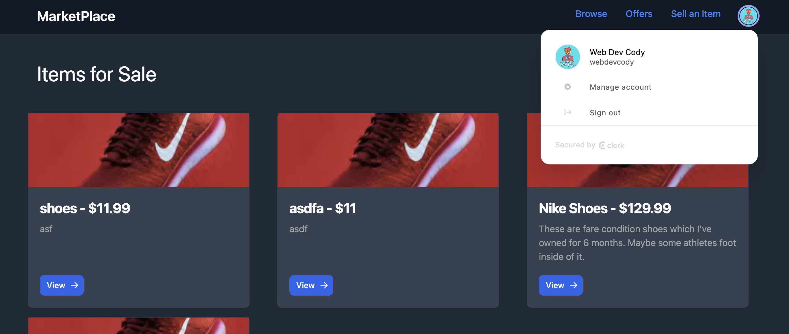

# Online Marketplace App

## Overview

This project was setup using create-t3-app, and uses all the optional settings except for next-auth. Instead, it uses https://clerk.com/ to authenticate users.

## How to Run

1. `npm i`
2. `npx prisma db push`
3. `npm run dev`
